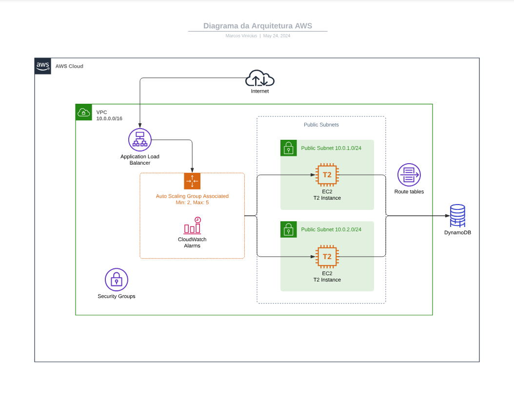
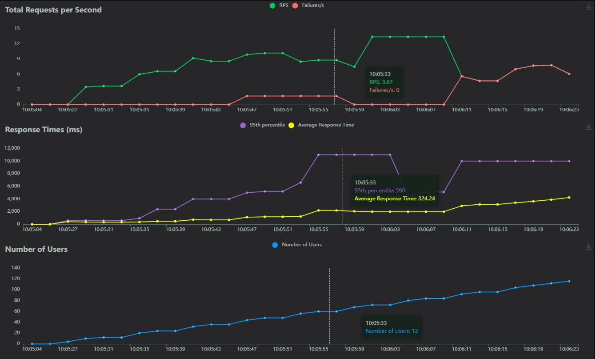

# Projeto de Computação em Nuvem com AWS

Este projeto visa provisionar uma infraestrutura na AWS utilizando AWS CloudFormation. A infraestrutura engloba o uso de um Application Load Balancer (ALB), instâncias EC2 com Auto Scaling e um banco de dados DynamoDB.

## Estrutura do Projeto

```plaintext
aws-cloudformation-project/
├── modules/ # Módulos do CloudFormation
├── application/ # Código da aplicação Next.js
├── tests/ # Pasta com scripts de teste de carga
├── public/ # Pasta com imagens e arquivos públicos
├── cloud-infra-setup.yaml # Arquivo principal
├── README.md # Relatório do projeto
```

## Infraestrutura como Código (IaC) com CloudFormation

### Visão Geral

Utilizamos o AWS CloudFormation para criar e gerenciar todos os recursos na AWS, garantindo que a infraestrutura seja provisionada de forma consistente e replicável. A abordagem de Infraestrutura como Código (IaC) permite automatizar o provisionamento e a atualização de recursos, além de facilitar a manutenção e a escalabilidade do projeto.

### Estrutura do Código

O arquivo `cloud-infra-setup.yaml` contém toda a definição da infraestrutura. Cada recurso é descrito em YAML, com comentários explicativos para facilitar a compreensão e a manutenção do código.

### Comentários Explicativos

Cada recurso no arquivo CloudFormation é comentado para descrever sua finalidade e configuração. Por exemplo, a configuração da VPC, Subnets, Internet Gateway, Tabelas de Roteamento, Grupos de Segurança, Configurações de Auto Scaling, Application Load Balancer e DynamoDB são todas explicadas em detalhes no arquivo YAML.

### Automação Completa

#### Criação da Key Pair

Antes de criar a infraestrutura, é necessário gerar uma Key Pair na região `us-east-2`. Siga os passos abaixo para criar a chave:

1. **Gerar a Key Pair no terminal:**

    ```sh
    aws ec2 create-key-pair --key-name MyKeyPair --region us-east-2 --query 'KeyMaterial' --output text > MyKeyPair.pem
    ```

2. **Modificar as permissões da Key Pair:**

    ```sh
    chmod 400 MyKeyPair.pem
    ```

#### Criação da Infraestrutura

Para criar a infraestrutura completa sem intervenção manual, utilizamos o seguinte comando AWS CLI:

```sh
aws cloudformation create-stack --stack-name minha-stack --template-body file://cloud-infra-setup.yaml --region us-east-2 --capabilities CAPABILITY_NAMED_IAM
```

Este comando cria todos os recursos definidos no arquivo `cloud-infra-setup.yaml` de uma só vez, provisionando a infraestrutura completa automaticamente.

#### Atualização da Infraestrutura

Para atualizar a infraestrutura completa, utilizamos o comando AWS CLI:

```sh
aws cloudformation update-stack --stack-name minha-stack --template-body file://cloud-infra-setup.yaml --region us-east-2 --capabilities CAPABILITY_NAMED_IAM
```

Este comando aplica as mudanças no arquivo YAML à infraestrutura existente, garantindo que qualquer modificação no código seja refletida nos recursos provisionados.

#### Destruição da Infraestrutura

Para destruir a infraestrutura completa, utilizamos o comando AWS CLI:

```sh
aws cloudformation delete-stack --stack-name minha-stack --region us-east-2
```

Este comando remove todos os recursos provisionados pela stack CloudFormation, permitindo uma limpeza completa do ambiente sem intervenção manual.

#### Visualização do Site

Comando para obter diretamente a URL do Load Balancer:

```sh
aws cloudformation describe-stacks --stack-name minha-stack --region us-east-2 --query "Stacks[0].Outputs[?OutputKey=='LoadBalancerDNSName'].OutputValue" --output text
```

## EC2 com Auto Scaling

### Launch Configuration

Criamos uma **Launch Configuration** que especifica a configuração das instâncias EC2, incluindo a AMI, tipo de instância, grupo de segurança, e a Key Pair para acesso SSH. No nosso caso, a configuração está definida no recurso `MyLaunchConfig` do arquivo `cloud-infra-setup.yaml`.

#### AMI com Aplicação Pré-Instalada

A **Amazon Machine Image (AMI)** usada (`ami-09040d770ffe2224f`) contém uma aplicação Next.js pré-instalada. A AMI foi configurada com todos os componentes necessários para a aplicação, incluindo as dependências Node.js e o código fonte. Isso garante que, ao lançar novas instâncias, elas estejam prontas para executar a aplicação imediatamente.

```yaml
MyLaunchConfig:
  Type: AWS::AutoScaling::LaunchConfiguration
  Properties:
    ImageId: ami-09040d770ffe2224f
    InstanceType: t2.medium
    SecurityGroups:
      - !Ref MySecurityGroup
    KeyName: MyKeyPair
    IamInstanceProfile: !Ref InstanceProfile
    UserData:
      Fn::Base64: !Sub |
        #!/bin/bash
        sudo apt-get update -y && sudo apt-get install -y git
        sudo curl -o- https://raw.githubusercontent.com/nvm-sh/nvm/v0.39.7/install.sh | bash
        export NVM_DIR="$HOME/.nvm" && [ -s "$NVM_DIR/nvm.sh" ] && \. "$NVM_DIR/nvm.sh" && [ -s "$NVM_DIR/bash_completion" ] && \. "$NVM_DIR/bash_completion"
        nvm install 20
        git clone https://github.com/marcosvds/todo-list-nextjs.git /home/ubuntu/app
        cd /home/ubuntu/app
        npm install && npm run build
        npm start &
```

### Auto Scaling Group (ASG)

Provisionamos um **Auto Scaling Group** (ASG) utilizando a Launch Configuration criada. O ASG é configurado para escalar o número de instâncias EC2 entre 2 e 5, com uma capacidade desejada de 2 instâncias. Está definido no recurso `MyAutoScalingGroup`.

```yaml
MyAutoScalingGroup:
  Type: AWS::AutoScaling::AutoScalingGroup
  Properties:
    LaunchConfigurationName: !Ref MyLaunchConfig
    MinSize: '2'
    MaxSize: '5'
    DesiredCapacity: '2'
    TargetGroupARNs:
      - !Ref MyTargetGroup
    VPCZoneIdentifier:
      - !Ref MySubnet
      - !Ref MySubnet2
    Tags:
      - Key: Name
        Value: CloudProjectInstance
        PropagateAtLaunch: true
      - Key: Environment
        Value: Production
        PropagateAtLaunch: true
```

### Políticas de Escalabilidade

Definimos políticas de escalabilidade baseadas em **CloudWatch Alarms**. Por exemplo, um alarme monitora a utilização da CPU e aciona uma política de aumento de escala se a utilização exceder 70%. O alarme está definido no recurso `CPUAlarmHigh` e a política no recurso `ScaleUpPolicy`.

```yaml
CPUAlarmHigh:
  Type: AWS::CloudWatch::Alarm
  Properties:
    AlarmDescription: "Alarme quando CPU > 70%"
    MetricName: CPUUtilization
    Namespace: AWS/EC2
    Statistic: Average
    Period: '300'
    EvaluationPeriods: '1'
    Threshold: '70'
    ComparisonOperator: GreaterThanOrEqualToThreshold
    AlarmActions:
      - !Ref ScaleUpPolicy

ScaleUpPolicy:
  Type: AWS::AutoScaling::ScalingPolicy
  Properties:
    AutoScalingGroupName: !Ref MyAutoScalingGroup
    AdjustmentType: ChangeInCapacity
    ScalingAdjustment: '1'
    Cooldown: '300'
```

### Integração do ASG com o ALB

Garantimos a integração do **Auto Scaling Group (ASG)** com o **Application Load Balancer (ALB)** através do **Target Group**. O ASG registra automaticamente as instâncias no ALB, garantindo a distribuição de tráfego entre elas. O Target Group está definido no recurso `MyTargetGroup`.

```yaml
MyTargetGroup:
  Type: AWS::ElasticLoadBalancingV2::TargetGroup
  Properties:
    VpcId: !Ref MyVPC
    Port: 80
    Protocol: HTTP
    HealthCheckProtocol: HTTP
    HealthCheckPort: 80
    HealthCheckPath: /
    Matcher:
      HttpCode: 200
    TargetType: instance
```
### Application Load Balancer (ALB)

#### Provisionamento do ALB

Para distribuir o tráfego entre as instâncias EC2, provisionamos um **Application Load Balancer (ALB)**. O ALB é configurado para distribuir o tráfego de entrada para as instâncias EC2 que fazem parte do Auto Scaling Group, garantindo alta disponibilidade e balanceamento de carga.

```yaml
MyLoadBalancer:
  Type: AWS::ElasticLoadBalancingV2::LoadBalancer
  Properties:
    Subnets:
      - !Ref MySubnet
      - !Ref MySubnet2
    SecurityGroups:
      - !Ref MySecurityGroup
    Type: application
```

#### Configuração dos Target Groups

Os **Target Groups** são utilizados para gerenciar as instâncias EC2. Eles permitem que o ALB distribua o tráfego apenas para as instâncias que estão registradas no grupo e que estão em um estado saudável.

```yaml
MyTargetGroup:
  Type: AWS::ElasticLoadBalancingV2::TargetGroup
  Properties:
    VpcId: !Ref MyVPC
    Port: 80
    Protocol: HTTP
    HealthCheckProtocol: HTTP
    HealthCheckPort: 80
    HealthCheckPath: /
    Matcher:
      HttpCode: 200
    TargetType: instance
```

#### Implementação de Health Checks

Os **Health Checks** são configurados para garantir que o tráfego seja direcionado apenas para instâncias saudáveis. Se uma instância EC2 não passar no health check, o ALB deixará de enviar tráfego para essa instância até que ela se torne saudável novamente.

```yaml
MyTargetGroup:
  Type: AWS::ElasticLoadBalancingV2::TargetGroup
  Properties:
    VpcId: !Ref MyVPC
    Port: 80
    Protocol: HTTP
    HealthCheckProtocol: HTTP
    HealthCheckPort: 80
    HealthCheckPath: /
    Matcher:
      HttpCode: 200
    TargetType: instance
```

#### Configuração do Listener

O **Listener** é configurado para ouvir o tráfego de entrada na porta 80 e encaminhar esse tráfego para o Target Group. Isso garante que o tráfego seja distribuído entre as instâncias EC2 do Auto Scaling Group.

```yaml
MyListener:
  Type: AWS::ElasticLoadBalancingV2::Listener
  Properties:
    DefaultActions:
      - Type: forward
        TargetGroupArn: !Ref MyTargetGroup
    LoadBalancerArn: !Ref MyLoadBalancer
    Port: 80
    Protocol: HTTP
```

Com estas configurações, garantimos que o Application Load Balancer distribua eficientemente o tráfego de entrada entre as instâncias EC2, mantendo a alta disponibilidade e a resiliência da aplicação. Além disso, a implementação de health checks assegura que o tráfego seja direcionado apenas para instâncias que estão funcionando corretamente, melhorando a confiabilidade do serviço.

### Banco de Dados DynamoDB

#### Provisionamento de uma Instância DynamoDB

Para provisionar uma instância do DynamoDB, utilizamos o recurso `AWS::DynamoDB::Table` no CloudFormation. Neste exemplo, criamos uma tabela chamada `PostsTable` com atributos `UserID`, `Title` e `Text`.

```yaml
PostsTable:
  Type: AWS::DynamoDB::Table
  Properties:
    TableName: PostsTable
    AttributeDefinitions:
      - AttributeName: UserID
        AttributeType: S
      - AttributeName: Title
        AttributeType: S
      - AttributeName: Text
        AttributeType: S
    KeySchema:
      - AttributeName: UserID
        KeyType: HASH
      - AttributeName: Title
        KeyType: RANGE
    GlobalSecondaryIndexes:
      - IndexName: TextIndex
        KeySchema:
          - AttributeName: Text
            KeyType: HASH
        Projection:
          ProjectionType: ALL
        ProvisionedThroughput:
          ReadCapacityUnits: 10
          WriteCapacityUnits: 10
    ProvisionedThroughput:
      ReadCapacityUnits: 10
      WriteCapacityUnits: 10
    Tags:
      - Key: Environment
        Value: Production
```

#### Configuração de Security Groups

Para garantir que apenas as instâncias EC2 possam se conectar ao banco de dados, configuramos políticas de acesso utilizando o IAM Role associado às instâncias EC2 e não diretamente através de Security Groups, já que o DynamoDB é um serviço gerenciado que não reside dentro de uma VPC. 

Criamos uma Role do IAM com permissões específicas para acessar a tabela do DynamoDB. Esta Role é atribuída às instâncias EC2 através do Instance Profile.

```yaml
DynamoDBAccessRole:
  Type: AWS::IAM::Role
  Properties:
    AssumeRolePolicyDocument:
      Version: "2012-10-17"
      Statement:
        - Effect: "Allow"
          Principal:
            Service: "ec2.amazonaws.com"
          Action: "sts:AssumeRole"
    Policies:
      - PolicyName: "DynamoDBAccessPolicy"
        PolicyDocument:
          Version: "2012-10-17"
          Statement:
            - Effect: "Allow"
              Action:
                - "dynamodb:GetItem"
                - "dynamodb:Scan"
                - "dynamodb:Query"
                - "dynamodb:PutItem"
                - "dynamodb:UpdateItem"
                - "dynamodb:DeleteItem"
              Resource: 
                - !GetAtt PostsTable.Arn

InstanceProfile:
  Type: AWS::IAM::InstanceProfile
  Properties:
    Roles:
      - !Ref DynamoDBAccessRole
```

Com essas configurações, asseguramos que apenas as instâncias EC2 que possuem o Instance Profile adequado possam interagir com a tabela do DynamoDB, garantindo a segurança e a integridade dos dados.

### Aplicação

#### Projeto Next.js Inicializado com Create Next App

A aplicação foi inicializada utilizando a ferramenta `create-next-app`, que configura automaticamente um ambiente de desenvolvimento com todas as dependências necessárias para iniciar um projeto Next.js. Este comando cria a estrutura básica do projeto, permitindo que os desenvolvedores comecem rapidamente.

#### Funcionalidades

A aplicação possui várias funcionalidades essenciais para gerenciar tarefas:

1. **Adicionar Tarefas**: 
   - Permite adicionar novas tarefas com um título e uma descrição. 
   - O usuário pode preencher um formulário e, ao submeter, a nova tarefa é salva no estado da aplicação e exibida na lista de tarefas.

2. **Lista de Tarefas**: 
   - Exibe uma lista de todas as tarefas adicionadas.
   - Cada tarefa na lista mostra seu título e descrição, facilitando a visualização e o gerenciamento das tarefas.

3. **Excluir Tarefas**: 
   - Permite excluir tarefas da lista.
   - Cada item na lista de tarefas inclui um botão de exclusão que, ao ser clicado, remove a tarefa correspondente do estado da aplicação, atualizando a lista exibida.

#### Link para Acesso

O código completo da aplicação está disponível no seguinte repositório GitHub: [todo-list-nextjs](https://github.com/marcosvds/todo-list-nextjs). Acesse para ver mais detalhes e explorar o código fonte.

### Análise de Custo com a Calculadora AWS

#### Visão Geral

Utilizamos a Calculadora de Custo da AWS para estimar os custos mensais associados à arquitetura proposta. A análise de custo é fundamental para garantir que o projeto seja viável economicamente e para prever o orçamento necessário para manter a infraestrutura em operação.

#### Recursos Considerados

Para uma estimativa precisa, consideramos os custos de todos os principais recursos utilizados na arquitetura, incluindo:

1. **Instâncias EC2**:
   - Tipos de instância: `t2.medium`
   - Quantidade mínima e máxima de instâncias conforme configurado no Auto Scaling Group
   - Horas de uso por mês
   - Volume de armazenamento associado às instâncias

2. **Application Load Balancer (ALB)**:
   - Horas de uso do ALB
   - Quantidade de regras
   - Tráfego processado pelo ALB

3. **DynamoDB**:
   - Capacidade provisionada para leitura e escrita (Read Capacity Units e Write Capacity Units)
   - Armazenamento de dados
   - Eventuais custos de backup e recuperação de dados

4. **Outros custos**:
   - Transferência de dados entre os serviços
   - Custos associados a logs e monitoramento via CloudWatch

#### Relatório de Análise de Custo

O relatório completo com a análise de custo detalhada pode ser acessado no seguinte link:

[Análise de Custo com a Calculadora AWS (PDF)](https://github.com/marcosvds/aws-cloudformation-project/blob/main/public/My%20Estimate%20-%20Calculadora%20de%20Pre%C3%A7os%20da%20AWS.pdf)

Esta análise ajudará a planejar e gerenciar o orçamento do projeto, garantindo que os custos se mantenham dentro dos limites previstos e que a infraestrutura possa ser sustentada de forma eficiente ao longo do tempo.

#### Escolha da Região us-east-2

A região us-east-2 foi escolhida devido a vários fatores, incluindo:

- **Custo**: Geralmente, a região us-east-2 oferece preços competitivos para serviços da AWS, ajudando a minimizar os custos operacionais.
- **Latência**: Localizada em Ohio, essa região oferece boa latência para os usuários nos Estados Unidos, especialmente no leste do país.
- **Disponibilidade de Serviços**: us-east-2 é uma região bem estabelecida com uma ampla disponibilidade de serviços AWS, garantindo que todos os recursos necessários estejam disponíveis.
- **Confiabilidade**: A região é conhecida por sua alta confiabilidade e desempenho, oferecendo várias zonas de disponibilidade para aumentar a resiliência da infraestrutura.

### Diagrama de Arquitetura AWS

Aqui está a representação visual da arquitetura AWS que provisionamos para este projeto:



### Análise de Carga

#### Ferramenta de Análise de Carga

Para implementar a análise de carga e desempenho da arquitetura, escolhemos o **Locust**. O Locust é uma ferramenta popular para testes de carga e desempenho, permitindo simular milhares de usuários simultâneos para testar a resistência de sistemas.

#### Configuração do Locust

Aqui está o código utilizado para o teste de carga com Locust:

```python
import uuid
from locust import HttpUser, task, between
from numpy import random

class MyUser(HttpUser):
    # Define o tempo de espera entre cada tarefa, variando entre 1 a 5 segundos
    wait_time = between(1, 5)
    
    # Define o host alvo para os testes de carga
    host = "http://minha--myloa-dvx9kptqyvuv-1885597525.us-east-2.elb.amazonaws.com/"
    
    @task
    def my_task(self):
        # Cria um corpo de requisição com dados fictícios para o envio do formulário
        body = {
            'UserID': f"{uuid.uuid4()}",  # Gera um ID único para cada usuário utilizando UUID
            'Title': 'Título teste',  # Define um título genérico para o teste
            'Text': 'Veja aqui você tem uma descrição genérica para sua atividade.'  # Texto descritivo genérico
        }

        # Envia uma requisição POST para o endpoint "api/submit-form" com o corpo definido acima
        self.client.post("api/submit-form", json=body)
        
        # Envia uma requisição GET para o endpoint "api/submit-form" e armazena a resposta
        response = self.client.get("api/submit-form")
        
        # Verifica se a resposta do GET foi bem-sucedida (status code 200)
        if response.status_code == 200:
            data = response.json()
            if data:
                # Se a resposta contém dados, imprime os dados recebidos
                print("Requisição GET retornou dados:", data)
            else:
                # Se a resposta não contém dados, informa que nenhum dado foi retornado
                print("Requisição GET não retornou nenhum dado")
        else:
            # Se a resposta do GET falhar, imprime o status code da falha
            print("Requisição GET falhou com o status code:", response.status_code)
```

#### Resultados da Análise de Carga

Para o teste de carga, utilizamos os seguintes parâmetros:

- **Number of Users to Simulate**: 120
- **Spawn Rate (Users per Second)**: 2
- **Duration**: 1 minuto

#### Gráficos e Observações

A imagem anexada mostra os resultados do teste de carga, com os seguintes gráficos:



1. **Total Requests per Second (RPS) e Failures/s**:
   - O gráfico mostra a taxa de requisições por segundo (RPS) e o número de falhas por segundo.
   - Observamos um aumento constante na RPS conforme o número de usuários aumentava.
   - A taxa de falhas permaneceu baixa durante a maior parte do teste, indicando boa resiliência da aplicação sob carga inicial.

2. **Response Times (ms)**:
   - O gráfico exibe os tempos de resposta médios e no percentil 95.
   - Houve um aumento nos tempos de resposta à medida que a carga aumentava.
   - O tempo de resposta médio permaneceu mais estável, mas também apresentou um aumento conforme a carga se intensificava.

3. **Number of Users**:
   - Este gráfico mostra o aumento no número de usuários durante o teste.
   - O número de usuários aumentou de forma constante conforme configurado para atingir o pico de 120 usuários no final do teste.

#### Observações e Conclusões

1. **Desempenho Inicial**:
   - A aplicação conseguiu lidar bem com a carga inicial, com poucas falhas e tempos de resposta aceitáveis.

2. **Aumento de Carga**:
   - À medida que o número de usuários aumentou, os tempos de resposta também aumentaram significativamente, especialmente no percentil 95, indicando possíveis gargalos de desempenho.

3. **Capacidade de Escala**:
   - A infraestrutura mostrou uma capacidade razoável de escalar com o aumento da carga, mas os tempos de resposta indicam que pode haver necessidade de otimizações para melhorar o desempenho sob cargas mais pesadas.